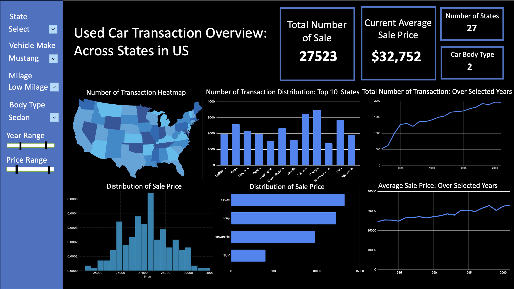

# Project Proposal

## Motivation and Purpose

### OUR ROLE: Data Science Consultancy Firm (Core Practices in Small Businesses Consulting and Environmental Awareness)

### TARGET AUDDIENCE: Car Dealerships in the United States and Private Sellers/Entrepreneurs.

In the aftermath left by the COVID-19 pandemic, the sale of new cars was extremely impacted, resulting in a reduction of supply given the global supply chain slowdown. The used car market as a result became extremely competitive, and to this day pricing vehicles accurately and understanding market trends by location is crucial to the success of dealing with 2nd had cars. Deals and private sellers often struggle to understand how to price their vehicles and know where the best geographical market is to maximize their returns and supply cars to customers in need.   
  
To address this, we are proposing a dashboard that analyzes the used car sales data from eBay, our dashboard will provide insights into trends relating to pricing, demand, and sale of cars by geography, and breakdowns of what cars are sought after by make, model, and type (SUV, Sedan, Coupe, etc.). By identifying these patterns and KPI that may help understand which areas of the United States demand certain vehicles – we can help private sellers be more informed on decisions related to pricing and organizing their inventory and product offering. Ultimately, we hope our dashboard leads to helping sellers succeed in optimizing their operations and satisfying more customers in need of 2nd hand vehicles through understanding the dynamics of the 2nd hard car market. We hope this tool assists dealers and potential entrepreneurs in identifying potential gaps in the market and possible investment opportunities – as well as promoting the practice of consuming second-hand cars to reduce the strain on the market and environment!

## Description of the data

The dataset we selected for our dashboard was sourced from eBay, which consists of numerous variables and metrics pertaining to cars sold online. The dataset is comprised of approximately 160,000 observations of used cars sold in the United States – the data set is described to span 20 months between 2019 and 2020, however, we see a number of sales in 2018 as well during our EDA. Some variables included are:

**Basic Car Details/Description:** Make, Model, Mileage, Year, Engine, Trim level, Body Style.  
  
**Sales Information:** Price car was sold for, Year the car was sold, ZIP code (location) of sale.

The dataset is comprised of both numerical and categorical features, for example `price sold` and `mileage` (continuous variable). As well as `make`, `body style`, and `model` (categorical variable) – as well as `year of sale` (temporal time-series variable).  
  
In our dashboard we plan to focus on the key variables that influence a car's sale and pricing, this includes variables such as `make`, `model`, `body style`, `year`, and `mileage`.  These variables are extremely important for understanding market trends, possible pricing strategies to employ, as well as the behavior and preferences of consumers in the 2nd hand card market. We will also rely on `ZIP Code` to understand the spatial relationship and nature of car sales, to understand what geographies look for certain types of cars, and which locations have the highest demand for cars.
  
One variable we look to derive and engineer for our visualization is `Price Range`, which will serve to categorize and bin the various cars sold into price brackets related to their level of ‘luxury’. This variable will include values such as: ‘economy’, ‘mid-range’, and ‘luxury’. This variable will help us understand and segment the market trends and patterns within the groups to know what level of vehicle consumers are looking for when buying 2nd hand. We will also be looking to make use of the `ZIP Code` variable and converting it to a usable Coordinate Reference System, preferably a linear CRS so that we can model and display sales within the United States since we are not working on a global scale where angular units would be useful.

## Research questions and usage scenarios

### Persona

- Name: Ali Wilson
- Age: 45
- Occupation: Used Car Dealership Owner
- Background: Ali is a mid-sized used car dealership owner in the Oregon. The used car market was impacted a lot during the COVID-19 - the price and stock varied a lot ever since the breakout of the pandamic. Thus, Ali seeks to optimize his inventory and sale price to meet local demand and maximize profits. Ali is tech-savvy and frequently uses digital tools to inform business strategies.

### User Story

Ali wants to refine the dealership's inventory acquisition strategy and pricing strategy to catch market demands and enhance its profitability. Based on some previous researches, Ali aims to understand regional preferences of car makes, models, and body styles compared to national trends. He also seeks to optimize the vehicle pricing based on the conditions of the car itself including mileage, year, and the price trend in local market. With these two information at hand, Ali can then adjust his inventory to focus on vehicles with higher demand and turnover rates.

The market data is everywhere, but Ali found it hard to put the data from different sources together and have a complete view of data at the quick look. Fortunately, Ali found the data dashboard we developed.

When Ali logs into the dashboard, he is greeted with an interactive map showing sales data by ZIP code, allowing him to pinpoint regional trends. Ali is able to use filters to compare the popularity and pricing of different car makes and models within his region or nationwide. He compares average prices for vehicles of similar make, model, year, and mileage in Oregon against the other states to identify opportunities to make profits. He identifies which car categories (economy, mid-range, luxury) are selling fastest in Oregon, using the 'Price Range' feature to segment the data. By using our dashboard, Ali notices a trend that mid-range SUVs are particularly popular in Oregon but are priced higher than the average price of neighbor states. This insight prompts an adjustment in his inventory acquisition and pricing stretagy.

Based on the insights gained from our dashboard, Ali decides to increase the inventory of mid-range SUVs and adjust his pricing strategy to align with national averages while remaining competitive locally. He also plans to reduce the stock of slow-moving vehicle types, optimizing the inventory to meet regional demand and improve sales turnover.

## App sketch & brief description
The app's sketch features a comprehensive dashboard that includes a variety of interactive elements to filter and adjust data visualizations. It encompasses 4 summary statistics, 6 graphs, 4 toggles, and 2 range selectors. On the left side of the dashboard, users can find the 4 toggles and 2 range selectors that offer extensive customization options. The first toggle is equipped with a drop-down menu for changing categories, specifically for selecting a U.S. state of interest. The second toggle allows users to choose a specific vehicle make, enhancing focus on a particular car brand in the visualizations; for instance, selecting 'Mustang' as the make allows we analyze the sale of mustang in different perspectives. The third toggle categorizes vehicles based on mileage, dividing them into groups such as pristine, low-mileage, mid-mileage, and high-mileage. The fourth toggle facilitates the selection of car body types. Following these toggles are the two range selectors, which enable users to specify the year and price range of the vehicles displayed in the graphs, thereby tailoring the dataset to their specific criteria.

The dashboard's layout also includes four summary statistics and six distinct graphical representations to visualize vehicle sales data effectively. The summary statistics provide a quick overview, showing the total number of sales, the average sale price, the number of states represented, and the number of vehicle body types sold. Moving to the graphical section, the first figure is a heatmap that displays the number of vehicles sold, offering an intuitive visualization of sales distribution geographically. The second is a numerical display highlighting the top 10 states with the highest number of vehicle transactions. The third is a line chart depicting the total number of vehicle transactions over the selected years. This is followed by a histogram that represents the distribution of car sale prices. The fifth figure is a bar chart, which illustrates the distribution of sales based on the body type of the vehicles. Finally, the sixth is a line chart that traces the average price of vehicles sold over the chosen years, providing insights into pricing trends.

